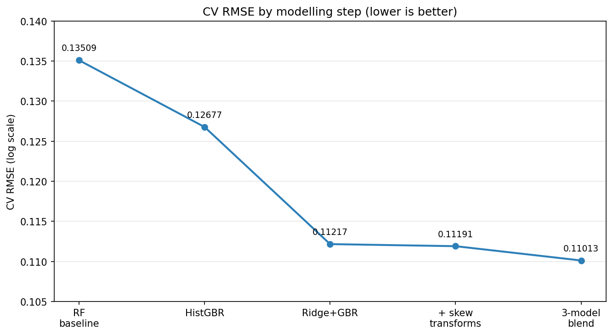

# Ames Housing — House Price Prediction

A regression model for Kaggle's *House Prices: Advanced Regression Techniques*, predicting residential sale prices in Ames, Iowa from 79 features.

**Result:** 326 / ~3,200 — top ~10% · 5-fold CV RMSE ≈ 0.110 (log scale)



## Problem
Predict `SalePrice` for each home. Submissions are scored on RMSE between the *logarithm* of the predicted and actual price, so a proportional error on a cheap house counts the same as on an expensive one.

## Approach
- **Cleaning** — domain-aware imputation: an `NA` that means "feature absent" (no pool, no basement) → `"None"` / `0`; genuine gaps → column mode; `LotFrontage` → median for its neighbourhood.
- **Encoding** — ordinal mapping for quality grades (`Po` < `Fa` < `TA` < `Gd` < `Ex`); one-hot for nominal fields.
- **Feature engineering** — `TotalSF`, total bathrooms, house/remodel age, and pool/garage/fireplace/2nd-floor flags.
- **Outliers** — removed the known oversized, underpriced Ames partial sales.
- **Skew** — `log1p` on the target and on heavily skewed area features.
- **Models** — a blend of Lasso, Ridge and `HistGradientBoostingRegressor` (Lasso 0.45 / GBR 0.30 / Ridge 0.25), with blend weights chosen on out-of-fold predictions to avoid overfitting.

## Repo contents
- `ames-housing-price-prediction.ipynb` — the full analysis
- `requirements.txt` — dependencies
- `progression.png` — the results chart above

## Data
The competition CSVs are **not** included — Kaggle competition data shouldn't be redistributed. Download them from the [competition data page](https://www.kaggle.com/competitions/house-prices-advanced-regression-techniques/data), or via the Kaggle CLI:

```bash
kaggle competitions download -c house-prices-advanced-regression-techniques
```

Place `train.csv` and `test.csv` in the repository root (they're gitignored, so they won't be committed). The notebook reads them from there.

## Running it
```bash
pip install -r requirements.txt
jupyter notebook ames-housing-price-prediction.ipynb
```
